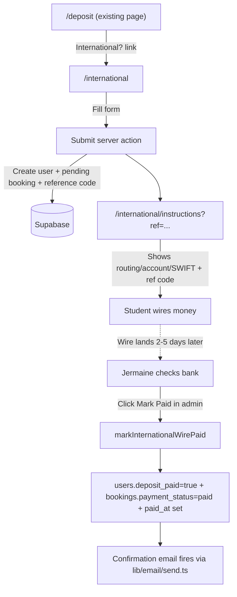
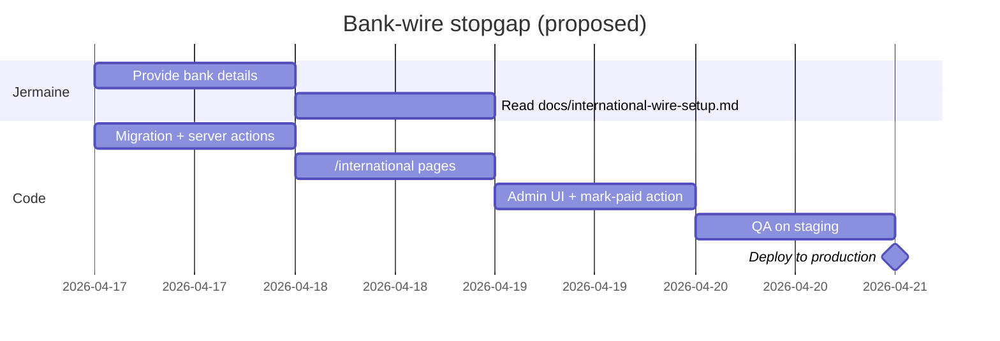

# International students path

> **Status:** Parked, not yet implemented. This is a stopgap plan.
> **Drafted:** 2026-04-17
> **Trigger to revisit:** the first international student reaches out unable to pay via Venmo, OR Jermaine confirms his bank wire details and greenlights implementation.
> **Supersedes:** this plan becomes obsolete once [docs/stripe-migration-plan.md](stripe-migration-plan.md) ships.

International students can't use the current Venmo-only flow — Venmo requires a US phone and US bank account. This plan ships a temporary bank-wire path to unblock them this week, while Jermaine starts the real fix (Stripe) in parallel.

---

## Two deliverables in this round

1. **Bank-wire path for international students** — minimal code, routes them around Venmo without adding a third-party processor.
2. **Short pitch** for Jermaine, making the case that Stripe must start this week.

---

## Part A: Bank-wire stopgap

### Product shape

- One new customer-facing page at `/international` that replaces the entire Venmo-gated deposit flow for students who can't use Venmo.
- Collapsed payment: the international student pays **deposit + full booking balance in a single wire**, not two. This is the key UX compromise — it dodges the "two wire fees for a $50 deposit" economics problem and cuts reconciliation overhead in half.
- Bank wire instructions are gated behind a short form (name, `.edu` email, school, dorm, boxes/items selection, move-out/move-in dates) so we capture the booking intent and generate a unique reference code to put in the wire memo line. The reference code is what Jermaine matches against when the wire lands.
- Single admin action once the wire clears: **Mark Paid** flips both `users.deposit_paid = true` AND `bookings.payment_status = 'paid'` in one click, mirroring the existing `markBookingPaid` mechanic in [lib/admin/actions.ts](../lib/admin/actions.ts).

### Data flow



### Files to change

- **New** `app/international/page.tsx` — mirrors the booking-configure UI (box picker + dates + dorm) but without the Venmo checkout branching. Submits to a new server action.
- **New** `app/international/instructions/page.tsx` — shows bank wire instructions + the user's unique reference code + "I've sent the wire" button that moves status to `wire_pending`.
- **New** `lib/booking/create-international-request.ts` — server action: creates the `users` row if missing, creates a `bookings` row with `status='pending_payment'` and a new `source='international_wire'` flag, generates a reference code (reuse `lib/payment/venmo.ts` short-booking-id logic), inserts a `payments` row with `provider='manual_wire'` and `status='pending'`.
- **Small edit** [app/deposit/DepositForm.tsx](../app/deposit/DepositForm.tsx) — add a single link below the existing Venmo card: *"International student? Pay by bank wire instead →"* routing to `/international`.
- **Small edit** [app/admin/(protected)/customers/CustomersTable.tsx](../app/admin/(protected)/customers/CustomersTable.tsx) — new chip "Wire pending" (gray) for international requests, with the reference code visible. Clicking "Mark paid" calls a new server action that flips both flags at once.
- **Small edit** [app/admin/(protected)/bookings/BookingsTable.tsx](../app/admin/(protected)/bookings/BookingsTable.tsx) — same "Wire pending" chip + the existing Mark Paid button wired to the new server action.
- **New** server action `lib/admin/mark-international-wire-paid.ts` — the atomic "flip both flags, set `paid_at`, fire confirmation email" function.
- **New migration** `docs/international-wire-migration.sql`:
  - `alter table bookings add column source text not null default 'web';` (values: `'web' | 'international_wire'`)
  - `alter table payments add column provider text not null default 'manual';` (values: `'venmo' | 'manual_wire' | 'manual'`) — this is the same column we'll add for the Stripe plan, so it pays forward.
- **New doc** `docs/international-wire-setup.md` — Jermaine reads this once; covers which fields to give us (routing/account/SWIFT/bank address), weekly reconciliation habit, how to handle refunds/overpayments.

### Config Jermaine must provide before we can go live

- Bank routing number
- Bank account number (the one he wants to receive wires on)
- Bank name + address (required by sender banks for international wires)
- SWIFT/BIC code
- Confirmation of his business name exactly as it appears on the account (wire senders need the beneficiary name to match)

These go into env vars so we can rotate them without a code change:

```
WIRE_BANK_NAME=...
WIRE_BANK_ADDRESS=...
WIRE_ROUTING_NUMBER=...
WIRE_ACCOUNT_NUMBER=...
WIRE_SWIFT_CODE=...
WIRE_BENEFICIARY_NAME=...
```

If he's uncomfortable sharing bank info on a public page, we put the instructions page behind Supabase auth (user must have submitted the form first) — which is the current plan anyway.

### What this plan deliberately does NOT do

- Does not collect the wire at a gateway — Jermaine reconciles by eyeballing his bank statement. That's the stopgap.
- Does not support partial payments or wire refunds automatically. If a student overpays/underpays, it's a manual email.
- Does not support currency conversion UX — we show USD amounts only. The student's bank handles FX on their side.
- Does not try to verify the wire landed automatically. Jermaine has to check.
- Does not integrate with the existing Venmo flow — intl students get a parallel track. When Stripe lands, this entire page can be deleted or folded into the Stripe branch.

### Risk ledger

- **Counterparty risk** — Jermaine has no money until the wire lands 2–5 days after the student commits. We mitigate by showing the booking as `pending_payment` (same as today's Venmo flow), holding the slot but not confirming.
- **Bank info exposure** — mitigated by gating instructions behind the auth'd form submission.
- **Wrong-amount wires** — mitigated by the unique reference code + showing the exact USD amount on the instructions page. Still has to be checked manually.
- **Students not reading fine print** — we add a prominent "wire fees of ~$25–$50 from your bank may apply and are on you" note.
- **Scale** — this path is fine for 1–20 intl students per season. Past that, Jermaine is manually reconciling wires. That's the forcing function for the Stripe migration.

### Rollout



---

## Part B: Stripe pitch for Jermaine

Copy-paste-able for a text or email. Tuned to a client, not technical.

---

> **Hey Jermaine — quick thing on payments.**
>
> We shipped a temporary path this week for international students to pay by bank wire (they can't use Venmo — US phone + US bank required). It works, but it adds more manual work for you: every international student means you're checking your bank statement, matching wires against reference codes, and clicking Mark Paid. For a handful of students this season it's fine. If we get more than 10–20 of them, it becomes a part-time job.
>
> The real fix is Stripe, and we want to start it this week for three reasons:
>
> 1. **It removes the two manual confirmations per customer.** Right now you Mark Paid once for the $50 deposit and once for the full booking balance. With Stripe, both flip automatically the second the payment clears. That's hours of your time back every week during peak season.
>
> 2. **International students pay with any card, no branches or exceptions in the product.** Same button, same flow as US students. No wire instructions, no reference codes, no 2–5 day wait.
>
> 3. **We learned from Square.** The reason Square froze you was documents sitting pending in the dashboard for too long. With Stripe we'll fix that from day one:
>    - Upload all verification docs within 48 hours of any dashboard prompt
>    - Open a support ticket with Stripe before we launch to explain the business (student seasonal storage, May/December rushes, US + international cards expected) so they don't flag the seasonal spike as suspicious
>    - You put a 15-minute weekly check on your calendar to log into the Stripe dashboard — same discipline we should have had with Square
>
> What I need from you this week:
>
> - **Day 1 (today or tomorrow):** Register at [dashboard.stripe.com/register](https://dashboard.stripe.com/register). Use your real business info (sole prop or LLC — whichever matches your taxes), your EIN or SSN, the bank account you want money paid to, `notimestorage.co` as the website, and "Storage & warehousing" as the industry.
> - **Day 2:** Upload whatever documents Stripe asks for. Don't wait.
> - **Day 3:** Open a support ticket in the Stripe dashboard with the business description I'll write up for you (I'll send you the exact text to paste).
> - **Day 4–5:** While you're getting verified, I'll be building the Stripe integration against test keys. When your live keys come through, I flip a switch and we're live.
>
> We'd have full Stripe payments live within a week and a half if we start now. Venmo stays as a backup. The bank-wire stopgap becomes unnecessary.

---

## Execution checklist (todos to hydrate when we pick this up)

- [ ] **jermaine-inputs** — Gather from Jermaine: bank routing, account number, SWIFT/BIC, bank name + address, beneficiary name exactly as on the account. Set env vars `WIRE_*` in Vercel.
- [ ] **migration** — Write `docs/international-wire-migration.sql`: add `bookings.source` + `payments.provider` (the `provider` column also pays forward to the future Stripe plan).
- [ ] **server-action-create** — Build `lib/booking/create-international-request.ts`: creates users + pending booking + payments row with `provider='manual_wire'`, `status='pending'`, generates reference code via existing `venmo.ts` helper.
- [ ] **customer-pages** — Build `app/international/page.tsx` (configure form mirroring booking-configure) and `app/international/instructions/page.tsx` (shows wire details + reference code + "I've sent the wire" confirmation button behind Supabase auth).
- [ ] **deposit-link** — Edit `app/deposit/DepositForm.tsx`: add "International student? Pay by bank wire instead" link below the existing Venmo card.
- [ ] **admin-mark-paid** — Build `lib/admin/mark-international-wire-paid.ts`: atomically flips `users.deposit_paid=true` + `bookings.payment_status=paid` + `paid_at`, fires confirmation email.
- [ ] **admin-ui** — Edit `CustomersTable.tsx` + `BookingsTable.tsx`: add "Wire pending" chip showing reference code; wire Mark Paid button to the new server action for wire rows.
- [ ] **jermaine-doc** — Write `docs/international-wire-setup.md`: what Jermaine sees when a wire request comes in, how to reconcile, what to do on over/underpayment and refunds.
- [ ] **stripe-pitch** — The pitch text above can be dropped into `docs/stripe-pitch-for-jermaine.md` for forwarding, or pasted directly into a text to the client.
- [ ] **qa-deploy** — End-to-end manual test on a fresh test user: submit form, get instructions, admin Mark Paid, confirmation email. Then push to main.

## Post-ship checklist

- [ ] Jermaine provides bank wire fields (routing, account, SWIFT, bank name + address, beneficiary name).
- [ ] `docs/international-wire-migration.sql` runs in Supabase.
- [ ] Env vars set in Vercel (Production, Preview, Development as needed).
- [ ] End-to-end manual test with a fake intl user: fill form → receive instructions → admin Mark Paid → confirmation email fires.
- [ ] Pitch delivered to Jermaine and he's started Stripe registration.
- [ ] Weekly recurring calendar reminder set up for Jermaine to check both his bank (for wires) and Stripe dashboard (once active).
