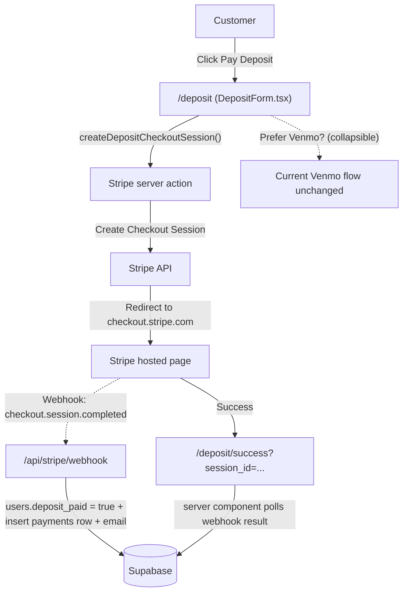
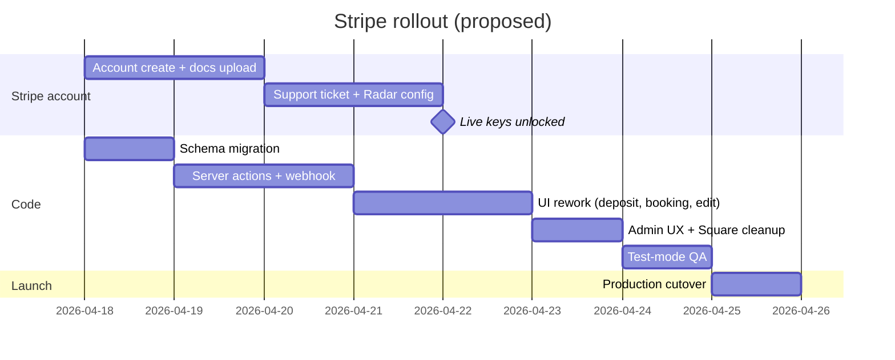

# Stripe primary, Venmo fallback — migration plan

> **Status:** Parked, not yet implemented.
> **Drafted:** 2026-04-17
> **Trigger to revisit:** when Jermaine is ready to set up a Stripe account, or when the first international student can't pay via Venmo.

This plan lives here so we can pick it up later without re-doing the discovery work. Context that shaped it:

- Current state is Venmo-only (see [docs/booking-flow-deposit-at-end.md](docs/booking-flow-deposit-at-end.md)), with two manual admin confirmations per customer — deposit and booking balance.
- International students are blocked because Venmo requires a US bank + phone.
- The previous Square integration was frozen because account verification docs weren't uploaded in time — that lesson is baked into Phase 0 below.

---

## Decisions locked in

- **Stripe is primary, Venmo stays as a fallback** on every payment screen.
- **Keep the two-payment flow** ($50 deposit gate → later the balance at booking checkout). No flow restructuring.
- **Upgrade flow included** — the booking-edit upgrade path also moves to Stripe.
- **Build in Stripe test mode first**; promote to live once Jermaine's account is verified.
- **Venmo and Square code cleanup**: Venmo code stays (it's the fallback). Square is **not** fully removable until **monthly plan** migrates — see [Square monthly plan (still on Square)](#square-monthly-plan-still-on-square) below.

## Why this is a good fit here

- International students get a native path on day one; no branch logic, no "are you US?" UX.
- Both `users.deposit_paid` and `bookings.payment_status` flip automatically via a Stripe webhook. Jermaine's two manual reconciliation steps become zero (for Stripe-paying customers).
- Venmo remains for US students who want fee-free, with the current `VenmoNoteChip` admin reconciliation unchanged.
- Existing `payments` table already has `stripe_transaction_id` per [docs/schema-audit.md](docs/schema-audit.md) — schema is half-prepped.

## High-level data flow

## Phase 0 — Stripe account onboarding (do first, in parallel with code)

This is the Square-freeze insurance. Two-thirds of the work is Jermaine's, so we produce a one-page checklist for him. Key moves:

1. **Create account with accurate business details** at [dashboard.stripe.com/register](https://dashboard.stripe.com/register).
   - Business type (sole prop vs LLC — needs matching tax docs)
   - EIN if LLC, else SSN
   - Bank account for payouts
   - Website URL = `https://notimestorage.co`
   - Industry = "Storage & warehousing" or "Moving services"
2. **Proactively upload all verification docs within 48h** of any dashboard prompt. Stripe freezes accounts that leave docs pending past 7 days.
3. **Open a pre-launch support ticket** from the Stripe dashboard describing:
   - Business model (student seasonal storage)
   - Expected monthly volume + average ticket (~$50 deposit, ~$250–400 balance)
   - Seasonal concentration (May + December graduation rushes — batches of 20–50 charges per week)
   - Customer base (students + parents, US and international cards expected)
   - This pre-empts Radar flagging the seasonal spike as "unusual activity".
4. **Weekly dashboard habit** — add a recurring item to [docs/current-todos.md](docs/current-todos.md) and the client handoff doc.
5. **Enable Radar at default sensitivity**, but add rule: `Allow if :card_country: = :ip_country:` with no 3DS for low-risk matching.

Deliverable: `docs/stripe-account-setup.md` with a checklist Jermaine follows in order.

## Phase 1 — Schema + small migration

One migration file at `docs/stripe-migration.sql`:

- Add `payments.provider text not null default 'manual'` (values: `'stripe' | 'venmo' | 'manual'`).
- Add `payments.stripe_checkout_session_id text` and `payments.stripe_payment_intent_id text` (keep existing `stripe_transaction_id` as a generic legacy column or drop — propose dropping it).
- Add unique index on `stripe_checkout_session_id` for webhook idempotency.
- No change to `users.deposit_paid` or `bookings.payment_status` — those keep their current meaning.

## Phase 2 — Stripe core wiring (new code)

- `npm i stripe` (pin to latest major).
- `lib/stripe/client.ts` — server-only SDK singleton; test keys vs live keys switched on `STRIPE_ENV`.
- Three server actions in `lib/stripe/`:
  - `createDepositCheckoutSession()` → $50, metadata `{ kind: 'deposit', user_id }`
  - `createBookingCheckoutSession(bookingId)` → balance in cents, metadata `{ kind: 'booking', booking_id, user_id }`
  - `createUpgradeCheckoutSession(bookingId, deltaCents)` → metadata `{ kind: 'upgrade', booking_id, delta_cents }`
  - Shared config: `billing_address_collection: 'required'`, `automatic_payment_methods: { enabled: true }` (gets Apple Pay, Google Pay, Link, international cards for free), `allow_promotion_codes: false`.
- New route `app/api/stripe/webhook/route.ts`:
  - Verifies signature against `STRIPE_WEBHOOK_SECRET`.
  - Handles `checkout.session.completed`:
    - `kind === 'deposit'` → flip `users.deposit_paid = true`, insert `payments` row (`provider: 'stripe'`, `payment_type: 'deposit'`), fire welcome email via existing [lib/email/send.ts](../lib/email/send.ts).
    - `kind === 'booking'` → flip `bookings.payment_status = 'paid'`, set `paid_at`, insert `payments` row, fire confirmation email.
    - `kind === 'upgrade'` → call the existing paid-upgrade apply logic (currently [lib/booking/apply-paid-upgrade-venmo.ts](../lib/booking/apply-paid-upgrade-venmo.ts) — generalize to `apply-paid-upgrade.ts` and take a `provider` arg).
  - Idempotency: if a `payments` row with that `stripe_checkout_session_id` exists, return 200 and short-circuit.
  - Also logs `checkout.session.expired` and `checkout.session.async_payment_failed` for observability (just a Sentry breadcrumb).
- New env vars in `.env.local` + Vercel: `STRIPE_SECRET_KEY`, `STRIPE_WEBHOOK_SECRET`, `STRIPE_ENV` (`test` | `live`). `STRIPE_PUBLISHABLE_KEY` only needed if we ever go client-side — Checkout redirect flow doesn't need it.

## Phase 3 — UI rework: Stripe primary, Venmo fallback

Pattern on all three customer-facing payment screens: **Stripe button on top, collapsible "Prefer to pay with Venmo?" below keeping the current VenmoBackupSection.**

### [app/deposit/DepositForm.tsx](../app/deposit/DepositForm.tsx)
- Primary button: **Pay Deposit** → POSTs to `createDepositCheckoutSession()` → redirect to Stripe Checkout.
- Below: `
` disclosure labeled **Prefer to pay with Venmo?** → renders existing `<VenmoBackupSection />`.
- Return URL: `/deposit/success?session_id={CHECKOUT_SESSION_ID}` — a new small server component that polls the booking layout check (up to 5s) and then routes the user to `/booking/configure` once the webhook has flipped `deposit_paid`.

### [app/booking/payment/page.tsx](../app/booking/payment/page.tsx)
- Primary button: **Book my Storage** → creates booking row (status `pending_payment`) → creates Stripe Checkout session → redirect.
- Venmo section becomes a collapsible "Prefer to pay with Venmo?" block using the existing code path.
- Success redirect: `/booking/confirmed?session_id=...&bookingId=...` — confirmed page checks the booking's `payment_status` and shows confirmed vs "processing" UI (the latter is a 2–3s stale window before webhook lands).

### [app/booking/edit/[id]/EditBookingForm.tsx](../app/booking/edit/[id]/EditBookingForm.tsx)
- Primary upgrade button: **Pay Upgrade** → `createUpgradeCheckoutSession()`.
- Collapsible Venmo fallback keeps the current `<VenmoBackupSection purpose="upgrade" />`.

### Empty/loading states
- While webhook is in flight (sub-second typically), show a lightweight "Confirming payment…" state with an auto-refresh. If still unpaid after 10s, surface a "Still processing — we'll email you" message and let user close the tab.

## Phase 4 — Admin UX updates

In [app/admin/(protected)/customers/CustomersTable.tsx](../app/admin/(protected)/customers/CustomersTable.tsx) and [app/admin/(protected)/bookings/BookingsTable.tsx](../app/admin/(protected)/bookings/BookingsTable.tsx):

- Paid rows from Stripe show a green **Stripe** chip with an external link to `https://dashboard.stripe.com/{test|live}/payments/{payment_intent_id}` — Jermaine clicks once to see the full Stripe record.
- Venmo-paid rows keep the current `VenmoNoteChip` for manual match.
- `Mark Paid` button stays — still needed for the Venmo fallback path.
- Revenue widgets (which we made "all-time only" yesterday) sum from `payments.amount` across all providers — unchanged logic.

## Square monthly plan (still on Square)

For anyone continuing this migration later:

- **Booking edit / paid upgrade** no longer uses Square; `lib/square/charge-upgrade.ts` is **removed** (Stripe + `pending_stripe_booking_upgrades` instead).
- **`app/actions/monthly-payments.ts` still uses Square** (`squareClient`, customers, cards, payments, orders, invoices). Until that module is rebuilt on Stripe, you **must**:
  - Keep the **`square`** npm dependency.
  - Keep **`next.config`** `serverExternalPackages` (or whatever the project uses) so the Square SDK bundles correctly.
  - Keep **Square credentials in Vercel** for any deployment where monthly billing is active.

Do **not** run `npm uninstall square` or delete `lib/square/client.ts` until `monthly-payments.ts` is migrated or the monthly plan feature is retired.

## Phase 5 — Square cleanup (after monthly plan migrates)

**Blocked until** `app/actions/monthly-payments.ts` no longer imports `@/lib/square/client` (or the monthly plan feature is removed).

Then:

- Delete remaining `lib/square/*` (e.g. `client.ts`, `deposit.ts`, `charge-booking.ts`) if nothing else imports them.
- Remove Square env vars from Vercel / `.env.local`.
- Prune Square-specific docs if desired.
- `npm uninstall square` and remove `square` from `next.config` server externals.

## Phase 6 — International-student story

No separate code path needed — Stripe handles everything once Phase 2 ships:

- Non-US cards accepted by default; `automatic_payment_methods` negotiates the right method per region.
- `billing_address_collection: 'required'` + default Radar handles 3DS triggers for high-risk regions (EU, India).
- **Fee reality**: Stripe charges Jermaine an extra 1.5% on non-US cards (so ~4.4% + $0.30 vs 2.9% + $0.30). Recommendation: **absorb the surcharge**. On a $300 booking that's $4.50 — not worth a surcharge UX or a separate price. Flag this to Jermaine in the client-facing summary doc.
- Update [app/page.tsx](../app/page.tsx) or FAQ copy to say "international students welcome — any card works." Small marketing win.

## Phase 7 — Testing plan

- Stripe test cards documented in `docs/stripe-testing.md`:
  - `4242 4242 4242 4242` — US success
  - `4000 0025 0000 3155` — 3DS required (proves 3DS redirect handled)
  - `4000 0000 0000 9995` — decline (proves webhook failure path)
  - `4000 0056 0000 0008` — non-US card (UK), `4000 0036 4000 0006` — AU card
- Extend [scripts/test-venmo-state.mjs](../scripts/test-venmo-state.mjs) → `scripts/test-payment-state.mjs` with `fresh | deposit-paid | booking-paid` states that work for either provider.
- Use Stripe CLI `stripe listen --forward-to localhost:3000/api/stripe/webhook` for local webhook testing. Documented in `docs/stripe-testing.md`.
- Manual test checklist:
  1. Deposit via Stripe (US card) → `deposit_paid` flips, welcome email, `/booking/*` unlocks.
  2. Deposit via Venmo fallback → still needs admin Mark Paid (unchanged).
  3. Booking via Stripe (non-US card + 3DS) → `payment_status=paid`, confirmation email.
  4. Upgrade via Stripe → items update, payment row inserted.
  5. Webhook replay (via Stripe dashboard) → idempotency holds, no duplicate `payments` rows.
  6. Network failure during redirect → booking sits in `pending_payment`, customer sees a friendly retry message, admin sees it as pending with an "expire" action.

## Phase 8 — Production cutover

- Add Stripe **live** keys to Vercel (Production env only); keep **test** keys in Preview + Development.
- Create the live webhook endpoint in Stripe Dashboard → `https://notimestorage.co/api/stripe/webhook` → copy the signing secret into Vercel.
- Flip `STRIPE_ENV=live` in Vercel Production. Redeploy.
- Smoke test with a real $1 charge to a dev card, then refund.
- Keep Venmo fallback fully operational so if Stripe goes sideways during a payment window, nobody's blocked.

## Rollout shape

## Execution checklist (todos to hydrate when we pick this up)

- [ ] **account-setup** — Produce `docs/stripe-account-setup.md`: step-by-step account creation, doc upload discipline, pre-launch support ticket template, weekly dashboard habit (all shaped by Square-freeze lessons).
- [ ] **schema-migration** — Write `docs/stripe-migration.sql`: add `payments.provider`, `stripe_checkout_session_id`, `stripe_payment_intent_id` + unique index for webhook idempotency.
- [ ] **stripe-core** — Install `stripe` SDK, build `lib/stripe/client.ts` + three server actions (deposit, booking, upgrade checkout sessions) with shared `billing_address` + `automatic_payment_methods` config.
- [ ] **webhook** — Build `app/api/stripe/webhook/route.ts`: verify signature, handle `checkout.session.completed` for deposit/booking/upgrade kinds, idempotency via session_id, email triggers, Sentry breadcrumbs on expired/failed.
- [ ] **ui-deposit** — Rework `app/deposit/DepositForm.tsx`: primary Pay Deposit (Stripe), collapsible Prefer Venmo block. Add `/deposit/success` server component that waits for webhook and routes to `/booking/configure`.
- [ ] **ui-booking** — Rework `app/booking/payment/page.tsx`: primary Book my Storage (Stripe), collapsible Venmo fallback. Update `/booking/confirmed` to handle Stripe `session_id` + webhook-pending UI.
- [ ] **ui-upgrade** — Rework `app/booking/edit/[id]/EditBookingForm.tsx`: primary Pay Upgrade (Stripe), collapsible Venmo fallback. Generalize `lib/booking/apply-paid-upgrade-venmo.ts` to `apply-paid-upgrade.ts` with `provider` arg.
- [ ] **admin-ux** — Update admin `CustomersTable` + `BookingsTable`: Stripe chip with dashboard link for Stripe-paid rows; `VenmoNoteChip` stays for Venmo rows; Mark Paid button retained for Venmo fallback.
- [ ] **square-cleanup** — Delete `lib/square/*`, square docs, `PRODUCTION-PAYMENT-SWITCH-CHECKLIST.md`, square npm dep, `SQUARE_*` env vars from `.env.local`.
- [ ] **testing** — Produce `docs/stripe-testing.md` + `scripts/test-payment-state.mjs` (replaces `test-venmo-state.mjs`, supports either provider). Document Stripe CLI local webhook forwarding.
- [ ] **cutover** — Production cutover checklist: live keys to Vercel Production only, register live webhook endpoint, flip `STRIPE_ENV=live`, smoke test $1 charge + refund.

## What the PR will ship (for reference when we build it)

- **New**: `lib/stripe/client.ts`, `lib/stripe/deposit.ts`, `lib/stripe/booking.ts`, `lib/stripe/upgrade.ts`, `app/api/stripe/webhook/route.ts`, `app/deposit/success/page.tsx`, `docs/stripe-account-setup.md`, `docs/stripe-testing.md`, `docs/stripe-migration.sql`, `scripts/test-payment-state.mjs`.
- **Modified**: `app/deposit/DepositForm.tsx`, `app/booking/payment/page.tsx`, `app/booking/edit/[id]/EditBookingForm.tsx`, `app/booking/confirmed/page.tsx`, `app/admin/(protected)/customers/CustomersTable.tsx`, `app/admin/(protected)/bookings/BookingsTable.tsx`, `lib/booking/apply-paid-upgrade-venmo.ts` (rename + generalize), `.env.local` (add Stripe, remove Square), `package.json` (+stripe, -square).
- **Deleted**: `lib/square/*`, related Square docs, `PRODUCTION-PAYMENT-SWITCH-CHECKLIST.md`.

## Open questions parked for later

- Should we offer **saved cards / auto-renewal** for students who re-book each semester? (Requires Stripe Customer records — trivial to add later.)
- Should the $50 deposit become **refundable on move-in** via automatic Stripe refund? Today it's baked into the total; we'd make it a discount applied at booking checkout. Small UX tweak — punt to v2.
- Stripe Tax — likely not needed for storage services in MA, but worth Jermaine asking his CPA.
